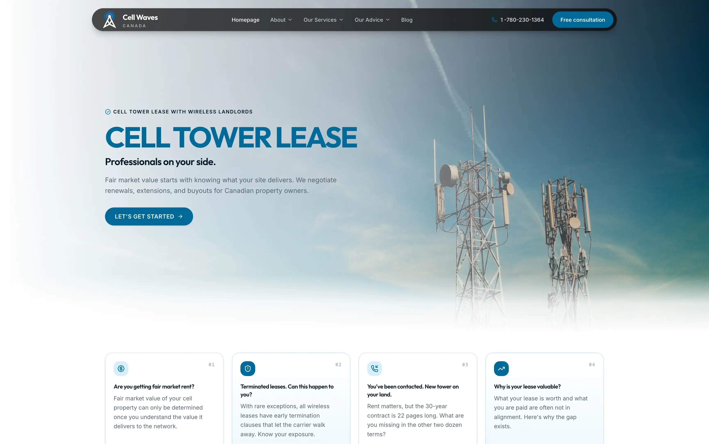

# Cell Waves Canada - Cell Tower Lease Experts

🗼 Expert cell tower lease negotiation for Canadian landlords, built with Astro, React, TypeScript, Tailwind, and shadcn/ui — maximizing lease renewals, extensions, and buyouts nationwide.

## ✨ Features

- **Landlord-Side Negotiation** — Dedicated expertise for lease renewals, extensions, and buyouts, never new-site brokering.
- **Full Service Catalog** — Seven dedicated service pages covering agreements, renewals, rooftop leases, buyouts, consultant costs, and hiring guidance.
- **Landlord Advice Hub** — Seven advice articles on lease rates, lease valuation, carrier mergers, upgrade requests, and tower attorneys.
- **Contact Form with Resend** — On-demand `/api/contact` endpoint that validates submissions and emails them through the Resend REST API, with loading, error, and success states.
- **Testimonials Carousel** — Verified landlord reports in an Embla-powered carousel with quote-first layout and local imagery.
- **Scroll-Reveal Animations** — Dedicated entrance animations per section with staggered grids and an animated process signal line, honoring `prefers-reduced-motion` and no-JS fallbacks.
- **Responsive by Design** — Fixed dock navigation, mobile drawer, and layouts that collapse cleanly below 768px.
- **Fast & Static First** — Astro static output with prerendered pages; only the contact API runs serverless on Vercel.

## 🧱 Tech Stack

- [Astro](https://astro.build/): Modern static site generator for building fast, content-focused websites.
- [React](https://react.dev/): Component library powering interactive islands such as the testimonial carousel and contact form.
- [TypeScript](https://www.typescriptlang.org/): Strongly typed programming language that builds on JavaScript.
- [Tailwind](https://tailwindcss.com/): Utility-first CSS framework for rapid UI development.
- [shadcn/ui](https://ui.shadcn.com/): Re-usable components built using Radix UI and Tailwind CSS.
- [Motion](https://motion.dev/): Animation library for entrance and state transitions in React islands.
- [Resend](https://resend.com/): Transactional email API behind the contact form.

## ☁️ Deploy your own

[](https://vercel.com/new/clone?repository-url=https://github.com/TowerFinder-Kurt-Access/cell-waves)
[](https://app.netlify.com/start/deploy?repository=https://github.com/TowerFinder-Kurt-Access/cell-waves)

## 🚀 Getting Started

Clone the repo, install deps, and boot the dev server:

```bash
git clone https://github.com/TowerFinder-Kurt-Access/cell-waves.git
cd cell-waves
bun install
bun run dev
```

Open [http://localhost:4321](http://localhost:4321) to view the app.

## 📦 Build for Production

```bash
bun run build
bun run preview
```

## 🔑 Environment

Copy the example file and fill in your Resend key:

```bash
cp .env.example .env
```

| Variable | Purpose |
| -------- | ------- |
| `RESEND_API_KEY` | Authenticates the contact form's `/api/contact` endpoint with Resend. Required in local `.env` and in the Vercel project settings. |

## 🗂️ Configuration

The site is componentized under `src`. Key areas to customize are:

```text
src/
	components/
		site/              # Header, footer, hero, homepage sections, contact form
		ui/                # shadcn/ui primitives
	layouts/
		base.astro         # Global shell, head tags, scroll-reveal observer
		article.astro      # Shared layout for service and advice pages
	pages/
		index.astro        # Homepage
		about-us.astro     # Team page
		why-select-us.astro
		testimonials.astro # Full landlord testimonials
		blog/              # Blog index and posts
		services/          # Seven service pages
		advice/            # Seven advice pages
		api/
			contact.ts      # POST endpoint wired to Resend
	scripts/
		count-up.ts        # Animated stat badges
	styles/
		global.css         # Theme tokens, reveal animations
	lib/
		content.ts         # Site-wide copy, navigation, testimonials, page data
public/
	images/                # Testimonial and blog imagery
```

## 🤝🏻 Contributing

Contributions are always welcome, whether you're fixing bugs, improving docs, or shipping new features that make the project better for everyone.

Check out [Contributing.md](Contributing.md) to learn how to get started and follow the recommended workflow.

## ⚖️ License

Copyright © Cell Waves Canada. All rights reserved.
